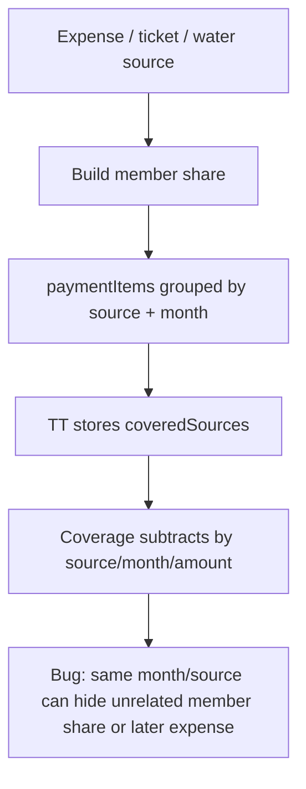
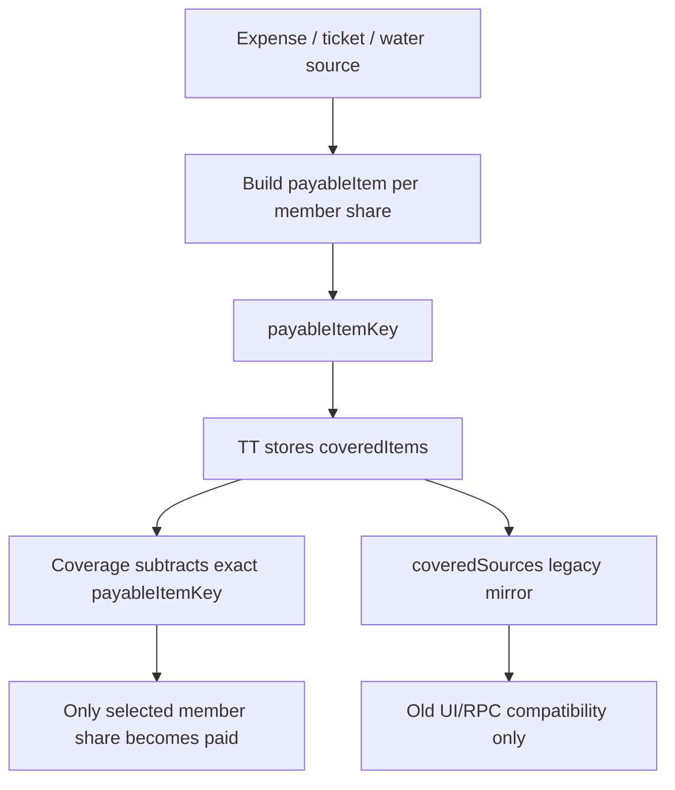

# Payable Items Payment Allocations — Implementation Record

**Status:** COMPLETE — implemented and pushed to `origin/main`.

**Completed commits:**
- `ecb3d2f` — tạo `payableItemKey`, lưu và apply `coveredItems`.
- `58a1a2b` — chuyển coverage legacy sang payable items, giữ fallback khi không map được.
- `380bb7a` — khoản phát sinh sau checkpoint vẫn hiện chưa thanh toán.

**Current source of truth:**
- Payment mới match theo `coveredItems.payableItemKey`, không match chỉ bằng source + month + amount.
- Cùng một expense chia nhiều member tạo item key khác nhau theo member/profile.
- `coveredSources` vẫn được ghi để tổng hợp và tương thích dữ liệu/RPC cũ.
- Chưa tạo bảng `payment_allocations`; metadata là implementation v1 đã chọn.

Checklist bên dưới là lịch sử kế hoạch ban đầu, không phải task đang chờ thực hiện. Không chạy lại plan này nếu không có regression mới.

**Goal:** Chuyển logic TT từ cover theo source/tháng/tổng tiền sang cover đúng phần tiền của từng member trong từng khoản phải thu.

**Architecture:** Không gắn `paid` vào `expense`, vì một expense chia cho nhiều member. Tạo canonical `payableItem` trong client data builder: một dòng = một phần tiền của một profile/member trong một source/month/expense. Payment mới lưu `coveredItems` theo item key; `coveredSources` giữ legacy fallback cho record cũ.

**Tech Stack:** React + Vite, Supabase metadata hiện có, Node test runner, `useScreenData.js` data builders.

---

## Success Criteria

- TT một khoản của Lê Tuấn không làm mất khoản của Trang trong cùng expense/source/month.
- TT khoản cũ không che khoản phát sinh sau checkpoint.
- Payment hộ lưu rõ người trả và người được trả hộ, nhưng coverage trừ theo item của người được trả hộ.
- Record cũ chỉ có `coveredSources` vẫn đọc được, nhưng record mới ưu tiên `coveredItems`.
- Không đổi DB schema trong v1.

## Current Problem



## Target Flow



## File Structure

- Modify: `src/hooks/useScreenData.js`
  - Add payable item key helper.
  - Emit `payableItemKey` on member and treasurer payment items.
  - Prefer `coveredItems` in coverage logic.
  - Keep `coveredSources` fallback for legacy records.
- Modify: `src/hooks/useScreenData.test.js`
  - Regression tests for exact item coverage.
  - Legacy `coveredSources` compatibility tests.
- Modify: `src/screens/Home.jsx`
  - Pass selected `coveredItems` from member payment sheet and treasurer sheet.
  - Keep current visual grouping.
- Modify: `src/screens/HomePaymentSheet.test.mjs`
  - Assert selected sheet items include item keys in confirm/share payload.
- Modify: `src/app-v2.jsx`
  - Preserve `coveredItems` in `confirmPaymentSent`, `markMemberPaid`, `confirmPaymentNotice`.
- Modify: `src/store.jsx`
  - Persist `metadata.coveredItems` alongside `metadata.coveredSources`.
  - Do not change RPC contract unless existing action already accepts metadata.
- Modify: `src/store-realtime.test.mjs`
  - Assert realtime/payment notification keeps `coveredItems`.
- Modify: `src/notifications-payment.test.mjs`
  - Assert notification review reads `coveredItems` first.
- Optional later: `supabase/migrations/*payment_allocations.sql`
  - Only after v1 metadata proves stable.

---

### Task 1: Snapshot + Impact Check

**Files:**
- Read only: `src/hooks/useScreenData.js`
- Read only: `src/screens/Home.jsx`
- Read only: `src/app-v2.jsx`
- Read only: `src/store.jsx`

- [ ] **Step 1: Snapshot dirty state**

Run:

```bash
git status --short
git log -5 --oneline
```

Expected:

```txt
M AGENTS.md
M CLAUDE.md
?? .claude/skills/
```

Do not touch those existing dirty files.

- [ ] **Step 2: GitNexus impact for symbols**

Run:

```bash
node .gitnexus/run.cjs impact -r Spliteasy-boss buildHomePaymentSummary --direction upstream
node .gitnexus/run.cjs impact -r Spliteasy-boss paymentCoverageForMember --direction upstream
node .gitnexus/run.cjs impact -r Spliteasy-boss applyConfirmedPaymentCoverage --direction upstream
node .gitnexus/run.cjs impact -r Spliteasy-boss buildTreasurerPaymentItems --direction upstream
node .gitnexus/run.cjs impact -r Spliteasy-boss coveredSourcesForPayment --direction upstream
```

Expected: direct callers include Home payment data builders and tests. If any result is HIGH or CRITICAL, stop and report blast radius before editing.

---

### Task 2: Add Failing Coverage Tests

**Files:**
- Modify: `src/hooks/useScreenData.test.js`

- [ ] **Step 1: Add exact item coverage test**

Add tests near existing payment coverage regression tests:

```js
test('confirmed payment covers only selected payable item, not another member in same source month', () => {
  const state = createScreenDataState({
    selectedYearMonth: '2026-07',
    profiles: [
      { id: 'profile-tuan', name: 'Lê Tuấn' },
      { id: 'profile-trang', name: 'Trang' },
    ],
    members: [
      { id: 'member-tuan', profile_id: 'profile-tuan', group_id: 'group-vk', name: 'Lê Tuấn' },
      { id: 'member-trang', profile_id: 'profile-trang', group_id: 'group-vk', name: 'Trang' },
    ],
    groups: [{ id: 'group-vk', name: 'Lấy vk để trưởng thành' }],
    expenses: [
      {
        id: 'expense-july-water',
        group_id: 'group-vk',
        title: 'Tiền nước',
        amount: 100000,
        expense_date: '2026-07-10',
        paid_by_member_id: 'member-tuan',
        status: 'approved',
      },
    ],
    expenseParticipants: [
      { expense_id: 'expense-july-water', member_id: 'member-tuan', share_amount: 50000 },
      { expense_id: 'expense-july-water', member_id: 'member-trang', share_amount: 50000 },
    ],
    paymentNotifications: [
      {
        id: 'payment-tuan',
        member_id: 'member-tuan',
        profile_id: 'profile-tuan',
        amount: 50000,
        status: 'confirmed',
        metadata: {
          coveredItems: [
            {
              payableItemKey: 'expense:expense-july-water|member:member-tuan|profile:profile-tuan|month:2026-07|amount:-50000',
              sourceType: 'group',
              sourceId: 'group-vk',
              sourceLabel: 'Lấy vk để trưởng thành',
              expenseId: 'expense-july-water',
              memberId: 'member-tuan',
              profileId: 'profile-tuan',
              month: '2026-07',
              amount: -50000,
            },
          ],
        },
      },
    ],
  });

  const tuan = buildHomeData(state, { profileId: 'profile-tuan' });
  const trang = buildHomeData(state, { profileId: 'profile-trang' });

  expect(tuan.paymentSummary.totalUnpaid).toBe(0);
  expect(trang.paymentSummary.totalUnpaid).toBe(-50000);
});
```

- [ ] **Step 2: Add post-checkpoint new item test**

Add:

```js
test('confirmed covered item does not hide later payable item in same source month', () => {
  const state = createScreenDataState({
    selectedYearMonth: '2026-07',
    profiles: [{ id: 'profile-tuan', name: 'Lê Tuấn' }],
    members: [{ id: 'member-tuan', profile_id: 'profile-tuan', group_id: 'group-vk', name: 'Lê Tuấn' }],
    groups: [{ id: 'group-vk', name: 'Lấy vk để trưởng thành' }],
    expenses: [
      {
        id: 'expense-july-09',
        group_id: 'group-vk',
        title: 'Vé ngày 09/07',
        amount: 50000,
        expense_date: '2026-07-09',
        paid_by_member_id: 'member-tuan',
        status: 'approved',
      },
      {
        id: 'expense-july-10',
        group_id: 'group-vk',
        title: 'Vé ngày 10/07',
        amount: 50000,
        expense_date: '2026-07-10',
        paid_by_member_id: 'member-tuan',
        status: 'approved',
      },
    ],
    expenseParticipants: [
      { expense_id: 'expense-july-09', member_id: 'member-tuan', share_amount: 50000 },
      { expense_id: 'expense-july-10', member_id: 'member-tuan', share_amount: 50000 },
    ],
    paymentNotifications: [
      {
        id: 'payment-july-09',
        member_id: 'member-tuan',
        profile_id: 'profile-tuan',
        amount: 50000,
        status: 'confirmed',
        metadata: {
          coveredItems: [
            {
              payableItemKey: 'expense:expense-july-09|member:member-tuan|profile:profile-tuan|month:2026-07|amount:-50000',
              sourceType: 'group',
              sourceId: 'group-vk',
              sourceLabel: 'Lấy vk để trưởng thành',
              expenseId: 'expense-july-09',
              memberId: 'member-tuan',
              profileId: 'profile-tuan',
              month: '2026-07',
              amount: -50000,
            },
          ],
        },
      },
    ],
    monthSettlements: [
      {
        id: 'settlement-aggregate-marker',
        member_id: 'member-tuan',
        profile_id: 'profile-tuan',
        group_id: 'group-vk',
        month: '2026-07',
        expense_id: null,
      },
    ],
  });

  const home = buildHomeData(state, { profileId: 'profile-tuan' });

  expect(home.paymentSummary.totalUnpaid).toBe(-50000);
  expect(home.paymentSummary.sourceBreakdown.some((source) => source.amount === -50000)).toBe(true);
});
```

- [ ] **Step 3: Run tests to confirm fail**

Run:

```bash
npm test -- src/hooks/useScreenData.test.js
```

Expected: new tests fail because current coverage does not use `coveredItems` exact keys yet.

---

### Task 3: Add Payable Item Key Helper

**Files:**
- Modify: `src/hooks/useScreenData.js`

- [ ] **Step 1: Add helper near payment item helpers**

Add:

```js
function normalizePayableItemAmount(amount) {
  const value = Number(amount) || 0;
  return Object.is(value, -0) ? 0 : value;
}

function buildPayableItemKey(item) {
  const expensePart = item.expenseId || item.expense_id || item.transactionId || item.transaction_id || 'no-expense';
  const memberPart = item.memberId || item.member_id || 'no-member';
  const profilePart = item.profileId || item.profile_id || 'no-profile';
  const monthPart = item.month || item.monthKey || item.yearMonth || 'no-month';
  const amountPart = normalizePayableItemAmount(item.amount);

  return [
    `expense:${expensePart}`,
    `member:${memberPart}`,
    `profile:${profilePart}`,
    `month:${monthPart}`,
    `amount:${amountPart}`,
  ].join('|');
}

function withPayableItemKey(item) {
  return {
    ...item,
    payableItemKey: item.payableItemKey || buildPayableItemKey(item),
  };
}
```

- [ ] **Step 2: Export only if tests already import internals**

If `useScreenData.test.js` imports helpers from `useScreenData.js`, add named export:

```js
export { buildPayableItemKey };
```

If tests only use public builders, do not export helper.

---

### Task 4: Emit `payableItemKey` From Payment Items

**Files:**
- Modify: `src/hooks/useScreenData.js`

- [ ] **Step 1: Update treasurer payment item creation**

In `buildTreasurerPaymentItems`, wrap each returned item:

```js
return withPayableItemKey({
  sourceType,
  sourceId,
  sourceLabel,
  expenseId,
  memberId,
  profileId,
  month,
  monthLabel,
  amount,
});
```

Keep existing fields unchanged. Add only `expenseId` if local data already has expense/session/ticket id available.

- [ ] **Step 2: Update member payment sheet item creation**

Where `sourcePaymentItems` or selected member items are mapped from `source.monthBreakdown`, wrap:

```js
const paymentItem = withPayableItemKey({
  ...existingItem,
  memberId: existingItem.memberId || currentMember?.id,
  profileId: existingItem.profileId || currentProfile?.id,
});
```

- [ ] **Step 3: Keep grouped UI unchanged**

Do not change labels, buttons, bill layout, or dropdown behavior in this task.

- [ ] **Step 4: Run focused tests**

Run:

```bash
npm test -- src/hooks/useScreenData.test.js
```

Expected: tests still fail only at coverage, not because item shape broke existing builders.

---

### Task 5: Store `coveredItems` On Confirm

**Files:**
- Modify: `src/screens/Home.jsx`
- Modify: `src/app-v2.jsx`
- Modify: `src/store.jsx`

- [ ] **Step 1: Convert selected items in `Home.jsx`**

When member sheet or treasurer sheet builds confirm payload, add:

```js
const coveredItems = selectedPaymentItems.map((item) => ({
  payableItemKey: item.payableItemKey,
  sourceType: item.sourceType,
  sourceId: item.sourceId,
  sourceLabel: item.sourceLabel,
  expenseId: item.expenseId,
  memberId: item.memberId,
  profileId: item.profileId,
  month: item.month,
  monthLabel: item.monthLabel,
  amount: item.amount,
}));
```

Then pass both fields:

```js
onAction('markMemberPaid', {
  ...existingPayload,
  coveredItems,
  coveredSources,
});
```

For member self-notification:

```js
onAction('confirmPaymentSent', {
  ...existingPayload,
  coveredItems,
  coveredSources,
});
```

- [ ] **Step 2: Forward payload in `app-v2.jsx`**

In `confirmPaymentSent`, `markMemberPaid`, and `confirmPaymentNotice`, keep:

```js
coveredItems: payload.coveredItems || [],
coveredSources: payload.coveredSources || [],
```

- [ ] **Step 3: Persist metadata in `store.jsx`**

In payment notification create/update metadata:

```js
metadata: {
  ...existingMetadata,
  coveredItems: action.coveredItems || payload.coveredItems || [],
  coveredSources: action.coveredSources || payload.coveredSources || [],
}
```

- [ ] **Step 4: Run store/UI tests**

Run:

```bash
node --test src/screens/HomePaymentSheet.test.mjs
node --test src/store-realtime.test.mjs
node --test src/notifications-payment.test.mjs
```

Expected: existing tests pass or fail with exact payload assertion mismatch only.

---

### Task 6: Apply Coverage By `coveredItems` First

**Files:**
- Modify: `src/hooks/useScreenData.js`
- Modify: `src/hooks/useScreenData.test.js`

- [ ] **Step 1: Add covered item reader**

Near `coveredSourcesForPayment`, add:

```js
function coveredItemsForPayment(payment) {
  const metadata = payment?.metadata || {};
  const items = metadata.coveredItems || payment?.coveredItems || [];
  return Array.isArray(items) ? items.filter((item) => item?.payableItemKey) : [];
}
```

- [ ] **Step 2: Prefer item-key coverage in `paymentCoverageForMember`**

Update coverage object to include:

```js
const coveredItems = confirmedPayments.flatMap(coveredItemsForPayment);
const coveredItemAmounts = new Map();

for (const item of coveredItems) {
  const key = item.payableItemKey;
  const amount = Math.abs(Number(item.amount) || 0);
  coveredItemAmounts.set(key, (coveredItemAmounts.get(key) || 0) + amount);
}
```

Return both:

```js
return {
  ...existingCoverage,
  coveredItemAmounts,
  hasCoveredItems: coveredItemAmounts.size > 0,
};
```

- [ ] **Step 3: Subtract exact keys in `applyConfirmedPaymentCoverage`**

Before legacy source/month matching:

```js
const keyedSource = withPayableItemKey(source);
const coveredAmount = coverage.coveredItemAmounts?.get(keyedSource.payableItemKey) || 0;

if (coveredAmount > 0) {
  const remaining = Math.min(0, keyedSource.amount + coveredAmount);
  return {
    ...keyedSource,
    amount: remaining,
    paidAmount: (keyedSource.paidAmount || 0) + Math.min(Math.abs(keyedSource.amount), coveredAmount),
  };
}

if (coverage.hasCoveredItems) {
  return keyedSource;
}
```

Then keep existing `coveredSources` fallback below this block.

- [ ] **Step 4: Repeat exact-key rule for month breakdown**

In `applyConfirmedPaymentCoverageToMonths`, apply the same key-first logic to each month/item row. If a month row has no `expenseId`, use `payableItemKey` from the original payment item when available.

- [ ] **Step 5: Run coverage tests**

Run:

```bash
npm test -- src/hooks/useScreenData.test.js
```

Expected: new tests pass and existing legacy tests still pass.

---

### Task 7: Update Payment Sheet Tests

**Files:**
- Modify: `src/screens/HomePaymentSheet.test.mjs`

- [ ] **Step 1: Add confirm payload test**

Add:

```js
test('member payment confirm payload includes coveredItems for selected rows', () => {
  const actions = [];
  renderHomePaymentSheet({
    onAction: (type, payload) => actions.push({ type, payload }),
    paymentItems: [
      {
        payableItemKey: 'expense:expense-1|member:member-tuan|profile:profile-tuan|month:2026-07|amount:-50000',
        sourceType: 'group',
        sourceId: 'group-vk',
        sourceLabel: 'Lấy vk để trưởng thành',
        expenseId: 'expense-1',
        memberId: 'member-tuan',
        profileId: 'profile-tuan',
        month: '2026-07',
        monthLabel: 'Tháng 7',
        amount: -50000,
      },
    ],
  });

  clickByText('Đã thanh toán');

  expect(actions[0].payload.coveredItems).toEqual([
    expect.objectContaining({
      payableItemKey: 'expense:expense-1|member:member-tuan|profile:profile-tuan|month:2026-07|amount:-50000',
      expenseId: 'expense-1',
      memberId: 'member-tuan',
      profileId: 'profile-tuan',
      amount: -50000,
    }),
  ]);
});
```

Use existing test helpers in this file. If helper names differ, adapt only names, not behavior.

- [ ] **Step 2: Run**

```bash
node --test src/screens/HomePaymentSheet.test.mjs
```

Expected: pass.

---

### Task 8: Legacy Compatibility Tests

**Files:**
- Modify: `src/hooks/useScreenData.test.js`
- Modify: `src/notifications-payment.test.mjs`

- [ ] **Step 1: Add legacy fallback assertion**

Add:

```js
test('legacy coveredSources still reduce unpaid amount when coveredItems is missing', () => {
  const state = createScreenDataState({
    selectedYearMonth: '2026-07',
    profiles: [{ id: 'profile-tuan', name: 'Lê Tuấn' }],
    members: [{ id: 'member-tuan', profile_id: 'profile-tuan', group_id: 'group-vk', name: 'Lê Tuấn' }],
    groups: [{ id: 'group-vk', name: 'Lấy vk để trưởng thành' }],
    expenses: [
      {
        id: 'expense-legacy',
        group_id: 'group-vk',
        title: 'Vé ngày',
        amount: 50000,
        expense_date: '2026-07-10',
        paid_by_member_id: 'member-tuan',
        status: 'approved',
      },
    ],
    expenseParticipants: [{ expense_id: 'expense-legacy', member_id: 'member-tuan', share_amount: 50000 }],
    paymentNotifications: [
      {
        id: 'payment-legacy',
        member_id: 'member-tuan',
        profile_id: 'profile-tuan',
        amount: 50000,
        status: 'confirmed',
        metadata: {
          coveredSources: [
            {
              sourceType: 'group',
              sourceId: 'group-vk',
              month: '2026-07',
              amount: -50000,
            },
          ],
        },
      },
    ],
  });

  const home = buildHomeData(state, { profileId: 'profile-tuan' });

  expect(home.paymentSummary.totalUnpaid).toBe(0);
});
```

- [ ] **Step 2: Run**

```bash
npm test -- src/hooks/useScreenData.test.js
node --test src/notifications-payment.test.mjs
```

Expected: pass.

---

### Task 9: Full Verification

**Files:**
- All modified files.

- [ ] **Step 1: Detect affected symbols**

Run:

```bash
node .gitnexus/run.cjs detect_changes -r Spliteasy-boss
```

Expected: changed symbols limited to payment item creation, payment confirmation payloads, and coverage builders.

- [ ] **Step 2: Run targeted tests**

Run:

```bash
npm test -- src/hooks/useScreenData.test.js
node --test src/screens/HomePaymentSheet.test.mjs
node --test src/store-realtime.test.mjs
node --test src/notifications-payment.test.mjs
```

Expected: all pass.

- [ ] **Step 3: Build**

Run:

```bash
npm run build
```

Expected: build completes without Vite/React compile errors.

- [ ] **Step 4: Browser verify**

Open:

```txt
http://localhost:5173/
```

Verify:

- Lê Tuấn tháng 7: khoản phát sinh sau chốt vẫn hiện chưa thu.
- Thủ quỹ TT một khoản: row dropdown thu gọn, số còn thu giảm đúng khoản chọn.
- Thanh toán hộ Mýt: profile Mýt chỉ mất khoản được tick, không mất tháng đã thanh toán trước đó.
- Member Home và tab Thanh toán cùng số.

---

### Task 10: Commit

**Files:**
- Stage only modified source/test files from this plan.

- [ ] **Step 1: Review diff**

Run:

```bash
git diff -- src/hooks/useScreenData.js src/hooks/useScreenData.test.js src/screens/Home.jsx src/screens/HomePaymentSheet.test.mjs src/app-v2.jsx src/store.jsx src/store-realtime.test.mjs src/notifications-payment.test.mjs
```

Expected: no changes to `AGENTS.md`, `CLAUDE.md`, or `.claude/skills/`.

- [ ] **Step 2: Stage exact files**

Run:

```bash
git add src/hooks/useScreenData.js src/hooks/useScreenData.test.js src/screens/Home.jsx src/screens/HomePaymentSheet.test.mjs src/app-v2.jsx src/store.jsx src/store-realtime.test.mjs src/notifications-payment.test.mjs
```

- [ ] **Step 3: Commit**

Run:

```bash
git commit -m "fix: track payment coverage by payable item"
```

- [ ] **Step 4: Push if user asks**

Run:

```bash
git push
```

---

## Later Phase: Real DB Allocation Table

Do this only if metadata becomes hard to audit.

Table shape:

```sql
CREATE TABLE public.payment_allocations (
  id uuid PRIMARY KEY DEFAULT gen_random_uuid(),
  payment_notification_id uuid REFERENCES public.notifications(id) ON DELETE CASCADE,
  payable_item_key text NOT NULL,
  source_type text NOT NULL,
  source_id uuid,
  expense_id uuid,
  member_id uuid NOT NULL REFERENCES public.members(id) ON DELETE CASCADE,
  profile_id uuid,
  month text NOT NULL,
  amount numeric NOT NULL,
  status text NOT NULL DEFAULT 'confirmed',
  created_at timestamptz NOT NULL DEFAULT now()
);

CREATE INDEX payment_allocations_item_idx ON public.payment_allocations(payable_item_key);
CREATE INDEX payment_allocations_member_month_idx ON public.payment_allocations(member_id, month);
```

Reason to defer: v1 can solve current bug with metadata and keeps schema/RPC stable.

## Self-Review

- Spec coverage: covers payable share identity, payment hộ, checkpoint/new debt, legacy records, and browser verification.
- Placeholder scan: no `TBD`, no unfilled steps.
- Type consistency: `payableItemKey`, `coveredItems`, `coveredSources`, `expenseId`, `memberId`, `profileId`, `month`, `amount` used consistently.
